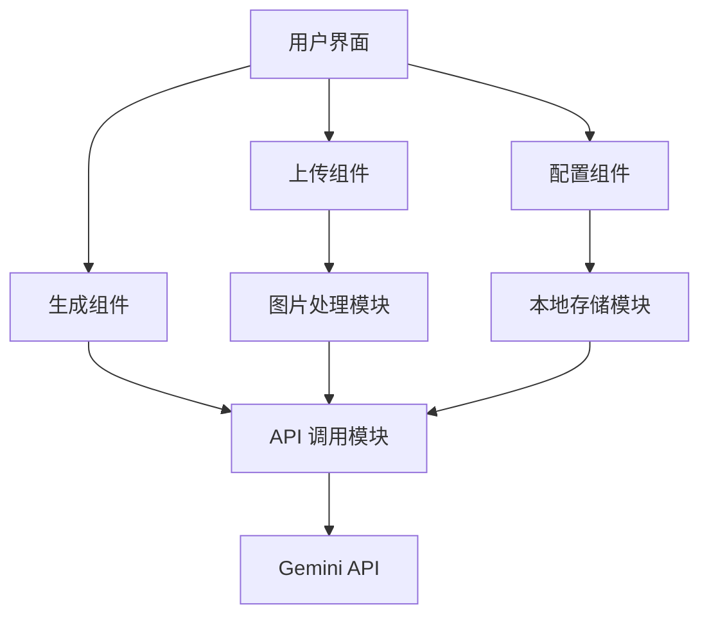
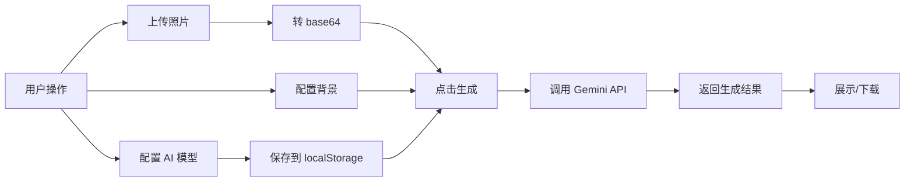

## 产品概述

一个基于 React + Vite 的头像风格化生成网站,用户可以上传个人照片,通过 AI 模型将照片转换为特定风格的头像。系统支持背景配置和 AI 模型参数自定义,所有配置保存在浏览器本地。

## 核心功能

- 照片上传与预览,支持拖拽上传
- 背景配置:支持纯色背景(颜色选择器)或自动背景,可添加重复插画元素
- AI 模型配置界面:支持配置 OpenAPI 兼容的 baseURL、API Token、模型名称(Gemini),配置保存在 localStorage
- 使用参考图片(refer_avatar.jpg)作为风格模板,调用 Gemini API 生成风格化头像
- 生成结果展示与下载功能
- 配置安全提示:明确告知用户配置仅保存在本地,不会上传到服务器

## 技术栈

- **前端框架**: React 18 + TypeScript
- **构建工具**: Vite
- **样式方案**: TailwindCSS
- **状态管理**: React Hooks (useState, useEffect, useContext)
- **本地存储**: localStorage (保存 AI 模型配置)
- **HTTP 客户端**: fetch API (调用 Gemini API)
- **图片处理**: FileReader API (转换为 base64)

## 系统架构

### 整体架构模式

采用单页应用(SPA)架构,基于组件化开发模式,前端直接调用 AI API 服务。



### 模块划分

#### 1. 图片上传模块 (UploadModule)

- **职责**: 处理照片上传、预览、格式验证
- **核心技术**: React + FileReader API
- **依赖**: 无
- **接口**: `onImageUpload(base64: string)`

#### 2. 背景配置模块 (BackgroundConfig)

- **职责**: 配置背景颜色、背景元素
- **核心技术**: React + TailwindCSS (颜色选择器)
- **依赖**: 无
- **接口**: `onConfigChange(config: BackgroundConfig)`

#### 3. AI 模型配置模块 (ModelConfig)

- **职责**: 配置和保存 API 参数(baseURL, token, model)
- **核心技术**: React + localStorage
- **依赖**: LocalStorageService
- **接口**: `onModelConfigSave(config: ModelConfig)`

#### 4. 头像生成模块 (AvatarGenerator)

- **职责**: 调用 AI API 生成风格化头像
- **核心技术**: fetch API + base64 编码
- **依赖**: ModelConfig, UploadModule
- **接口**: `generateAvatar(image: string, config: GenerateConfig)`

#### 5. 本地存储服务 (LocalStorageService)

- **职责**: 管理配置数据的持久化
- **核心技术**: localStorage API
- **依赖**: 无
- **接口**: `saveConfig()`, `loadConfig()`, `clearConfig()`

### 数据流



## 实现细节

### 核心目录结构

```
avatar-maker-website/
├── src/
│   ├── components/
│   │   ├── ImageUpload.tsx      # 图片上传组件
│   │   ├── BackgroundConfig.tsx # 背景配置组件
│   │   ├── ModelConfig.tsx      # AI 模型配置组件
│   │   ├── AvatarGenerator.tsx  # 生成结果组件
│   │   └── PrivacyNotice.tsx    # 隐私提示组件
│   ├── services/
│   │   ├── apiService.ts        # API 调用服务
│   │   └── storageService.ts    # localStorage 服务
│   ├── types/
│   │   └── index.ts             # TypeScript 类型定义
│   ├── utils/
│   │   ├── imageProcessor.ts    # 图片处理工具
│   │   └── validators.ts        # 验证工具
│   ├── assets/
│   │   └── refer_avatar.jpg     # 参考风格图片
│   ├── App.tsx
│   └── main.tsx
├── public/
├── index.html
├── package.json
├── vite.config.ts
└── tailwind.config.js
```

### 关键代码结构

```typescript
// 类型定义
interface ModelConfig {
  baseURL: string;
  apiToken: string;
  modelName: string;
}

interface BackgroundConfig {
  type: 'color' | 'auto';
  color?: string;
  elements?: string;
}

interface GenerateRequest {
  userImage: string;      // base64
  referenceImage: string; // base64
  background: BackgroundConfig;
}

// API 服务
class ApiService {
  async generateAvatar(
    config: ModelConfig,
    request: GenerateRequest
  ): Promise<string> {
    // 调用 Gemini API
  }
}

// 存储服务
class StorageService {
  saveModelConfig(config: ModelConfig): void {}
  loadModelConfig(): ModelConfig | null {}
  clearModelConfig(): void {}
}
```

### 技术实现方案

#### 1. 图片上传与处理

**问题**: 将用户上传的图片转换为 base64 格式
**方案**: 使用 FileReader API
**实现步骤**:

1. 监听文件输入的 onChange 事件
2. 使用 FileReader.readAsDataURL() 读取文件
3. 在 onload 回调中获取 base64 字符串
4. 验证图片格式(JPEG/PNG)和大小(< 5MB)
5. 更新组件状态并预览

**潜在挑战**: 大文件处理性能问题
**缓解策略**: 限制文件大小,添加 loading 状态

#### 2. AI API 调用

**问题**: 调用 Gemini API 生成风格化头像
**方案**: 使用 fetch API,符合 OpenAPI 标准
**实现步骤**:

1. 从 localStorage 读取配置(baseURL, token, model)
2. 将用户图片和参考图片转为 base64
3. 构建符合 Gemini API 格式的请求体
4. 设置请求头(Authorization, Content-Type)
5. 发送 POST 请求并处理响应

**潜在挑战**: API 调用失败、超时、配置错误
**缓解策略**: 添加错误处理、重试机制、配置验证

#### 3. 本地配置管理

**问题**: 安全存储 API 配置
**方案**: localStorage + 加密提示
**实现步骤**:

1. 创建 StorageService 封装 localStorage 操作
2. 使用 JSON.stringify/parse 序列化配置
3. 在配置页面添加明显的隐私提示
4. 提供清除配置的选项
5. 页面加载时自动读取配置

**潜在挑战**: localStorage 容量限制、数据泄露
**缓解策略**: 仅存储必要配置,添加隐私提示

### 集成点

- **Gemini API 集成**: 通过 fetch 发送 POST 请求,使用 OpenAPI 兼容格式
- **数据格式**: JSON 格式传输,图片使用 base64 编码
- **认证机制**: Bearer Token 认证(API Token)

## 技术考量

### 性能优化

- 使用 React.memo 优化组件渲染
- 图片上传前进行压缩(可选)
- API 调用添加防抖处理
- 使用 lazy loading 延迟加载组件

### 安全措施

- 输入验证:文件类型、大小、格式
- API Token 仅存储在 localStorage,不发送到其他服务器
- 明确的隐私提示:配置不会上传到后台
- XSS 防护:使用 React 默认转义

### 开发工作流

- 开发环境: Vite dev server (HMR 支持)
- 构建流程: `npm run build` 生成生产包
- 测试策略: 手动测试 + 边界情况验证
- 版本控制: Git,配置文件添加到 .gitignore

## 设计风格

采用现代简约风格,以科技感和专业性为主题。使用深色调与亮色点缀相结合,营造高端、智能的氛围。整体布局清晰,交互流畅,注重用户体验。

## 页面规划

设计单页应用,包含以下功能区块:

### 1. 顶部导航栏

- 居中显示应用标题"AI 头像生成器",使用渐变文字效果
- 右侧显示 AI 模型配置入口图标,点击弹出配置对话框
- 采用半透明玻璃态效果,背景模糊

### 2. 主内容区 - 三栏布局

**左侧 - 图片上传区**

- 大尺寸拖拽上传区域,虚线边框,悬停时高亮
- 支持点击上传和拖拽上传
- 上传后显示图片预览,带圆角和阴影效果
- 底部显示重新上传按钮

**中间 - 背景配置区**

- 背景类型选择:纯色/自动(单选按钮组)
- 颜色选择器:渐变色卡片 + 自定义颜色输入
- 背景元素输入框:文本描述插画元素
- 使用卡片式设计,清晰分组

**右侧 - 生成结果区**

- 初始状态显示占位符(虚线框 + 提示文字)
- 生成中显示加载动画(渐变旋转圆环)
- 生成完成显示结果图片,带放大和下载按钮
- 圆角卡片容器,投影效果

### 3. 底部操作区

- 大尺寸"生成头像"按钮,渐变背景,悬停动效
- 隐私提示文字(小字号,灰色):配置仅保存本地

### 4. AI 模型配置对话框

- 居中模态框,玻璃态背景
- 表单字段:API 地址、Token(密码框)、模型名称
- 保存/取消按钮,清除配置链接
- 顶部显眼的隐私提示横幅(黄色背景)

## 交互设计

- 上传区域悬停放大,拖入时边框高亮
- 按钮悬停渐变动画,点击缩放反馈
- 配置对话框淡入淡出动画
- 生成中显示进度提示和加载动画
- 结果图片支持点击放大预览

## 响应式设计

- 桌面端:三栏横向布局
- 平板端:上下堆叠,保持宽度比例
- 移动端:单列垂直布局,按钮全宽